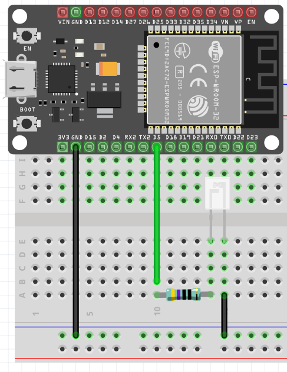

# Sending IR signals for Air Conditioner using RMT with ESP32
This is a simple code using RMT (Remote Control) module driver to send infrared remote control signals to the air conditioner.

I was developing a code in my spare time in Arduino IDE to control the air conditioning (AC) using infrared sensor (IR) with a ESP32, however when completing the task, as I was using some peripherals (screen and button, in addition the IR) plus the delays within the code, I decided to use threads to organize better the execution time of each task and that experience has not been good in the Arduino IDE. Changing platform I ended up downloading the ESP-IDF 4.3v where I was able to run the codes without a problem and use the threads.

Rewriting from Arduino IDE to ESP-IDF some doubts were raised, since I wouldn’t use the same Arduino libraries, and specifically in the IR library I didn’t find any simple and easy content like in Arduino IDE libraries. From that came the motivation to try to understand the RMT module which from what I’ve been seeing was the most used for things like that on ESP-IDF.

## Little Guide
### Observation:
Maybe (and probably) these methods presented may not function for all AC. But with my AC it worked without too many problems. The only problem I found was the AC’s perceived distance, to work I was about 2 cm away from AC and I haven’t found the cause and the solution yet.

## Step 1 (Arduino IDE):
First of all it is necessary to have the controller values to turn the AC ON/ OFF. To obtain this will be necessary an IR receiver and a code that makes this reading. For the Arduino Uno I ended up using the tutorial below:

https://www.youtube.com/watch?v=9aLpvhuABK4 

You will need: Arduino Uno, IR receiver (like TSOP36230) and AC controller. With the code running, just click on and off on the AC control aiming for the IR receiver.

## Step 1.1 (Arduino IDE):
If you want to do from ESP32 instead of Arduino Uno I used the tutorial below, wich is basically repeat the build above, set a read pin (I used D15) and press on AC control to turn on and off aiming in the same way at the IR receiver.

https://community.dfrobot.com/makelog-308344.html

## Step 2 (ESP-IDF):
Now that you have the code values to turn the AC on and off we need a code to send these values to the AC. You will need a IR transmitter and a 470 Ohm resistor, in the video of step 1 a transistor is also used, however in this project it was not used. The construction of IR in ESP is simple as show below:



Done this assembly just go to the code presente in this repo and change the values of powerOn and powerOff array. At first the code should work, remembering that when using the IR it should be around 2cm os less close to the AC, I believe this distance should vary from device to device. Maybe that transistor in step 1 is a amplifier for that IR transmitter.

## Understanding the problem:
As I found it difficult to find some content for my specific problem I started doing some searches. The first was trying to understand the library IRsend.h that is used together with the IRremoteESP8266.h. Roughly, ignoring the rest of the library and focusing on the "sendRaw" function, used in step 1.1, it basically takes the parameters and it defines where is high and low, by the input buffer index, which is the array of AC values.

```C++
void IRsend::sendRaw(const uint16_t buf[], const uint16_t len, const uint16_t hz){
// Set IR carrier frequency
  enableIROut(hz);
  for (uint16_t i = 0; i < len; i++){
    if (i & 1) {  // Odd bit. Low
      space(buf[i]);
    } else {  // Even bit. High
      mark(buf[i]);
    }
  }
  ledOff();  // We potentially have ended with a mark(), so turn of the LED.
}
```

Looking at the “space” function it simply determines that the IR LED is off, and the time it will be off is the value of the powerOff array, that is, each value of that array corresponds to a time that the IR LED will be off by X us.  
```C++
void IRsend::space(uint32_t time) {
  ledOff();
  if (time == 0) return;
  _delayMicroseconds(time);
}
```

The same is seen in the “mark” function, which does almost the same as the “space” function but now with the IR LED on. 

```C++
uint16_t IRsend::mark(uint16_t usec) {
  // Handle the simple case of no required frequency modulation.
  if (!modulation || _dutycycle >= 100) {
    ledOn();
    _delayMicroseconds(usec);
    ledOff();
    return 1;
  }
  
  //Making others stuffs...
  //...
}
```

A bit of this process is explained in this tutorial where is done a reverse engineering of an AC control. 

https://www.instructables.com/Reverse-engineering-of-an-Air-Conditioning-control/

After having understood a little how the IR Arduino IDE library works I started to research about the RMT library. In the search I found the guide of the ESP-IDF itself, however what helped me was Niel Kolban’s book about ESP32. Which can be acquired for free at the link below.

https://leanpub.com/kolban-ESP32

From the book you can get na idea of how the RMT works and how the data structure that I used for the IR LED is arranged. Below is this structure, where you can see how the data is arranged in type rmt_item32_t and channels.


That is, each item of this object has a level and a period, with the level apparently indicating high or low and the period being the time for this signal to go high or low.
Below the book brings an illustration of this, with duration0 (d0) and duration1 (d1) corresponding to low and high.


Understanding this structure, the only thing to do was pass all the odd indexes of the AC control's code array to duration1 and all the even indexes to duration0. As each object (rmt_item32_t) index has high and low values our array has been halved.
